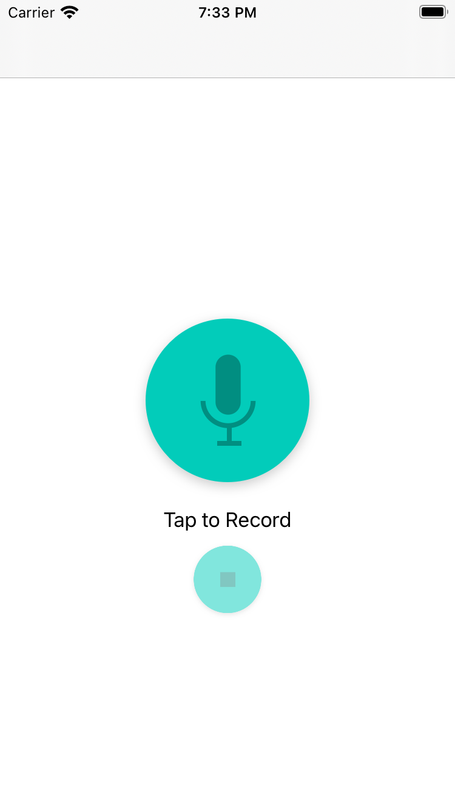
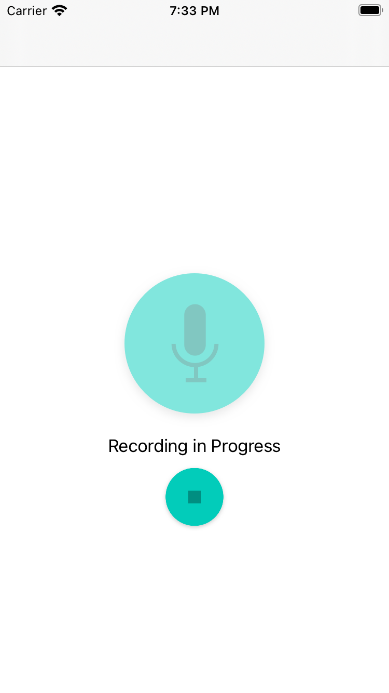
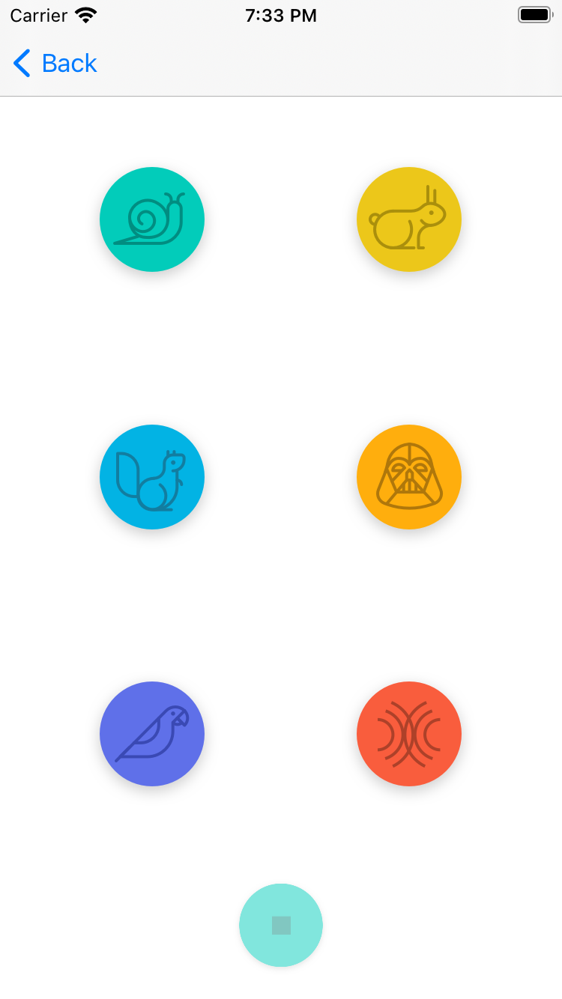

# Pitch Perfect

Pitch Perfect is an iOS app that allows users to record their voice and play it back using multiple audio effects, such as speed rate variation, pitch alteration, echo and reverb. It is the first project of Udacity's [iOS Developer Nanodegree Program](https://www.udacity.com/course/ios-developer-nanodegree--nd003). 

